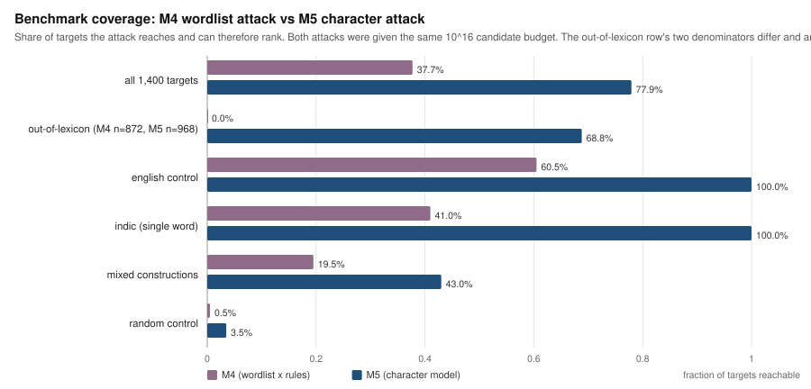
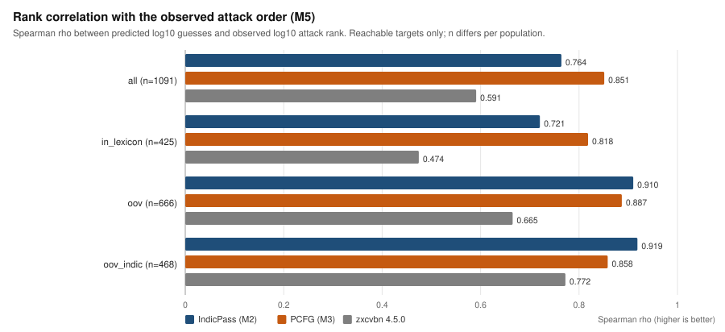
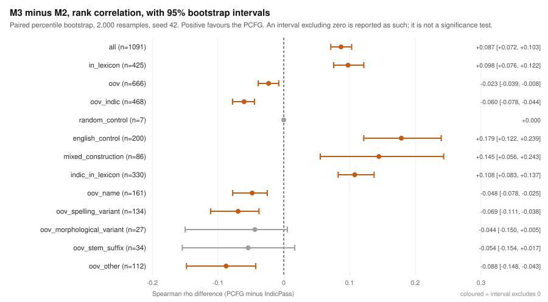
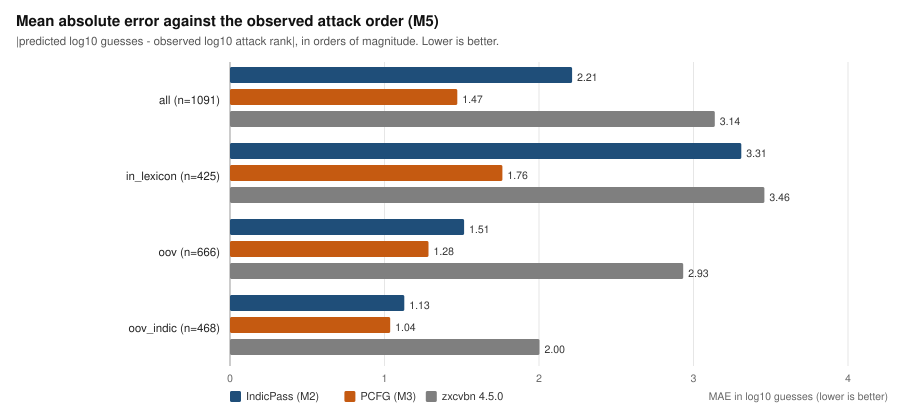
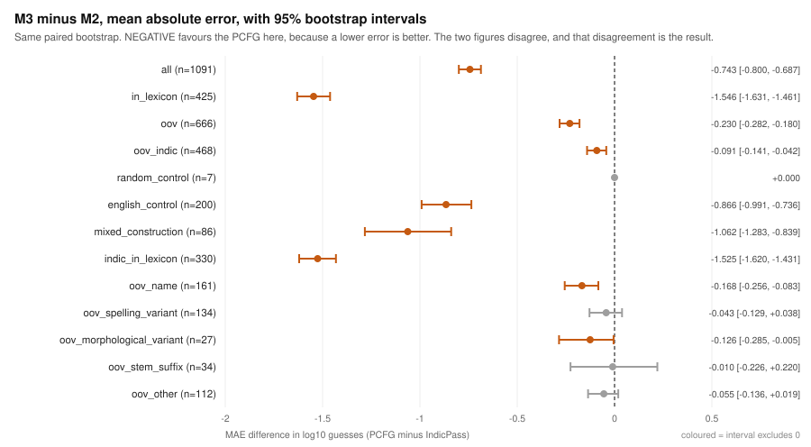
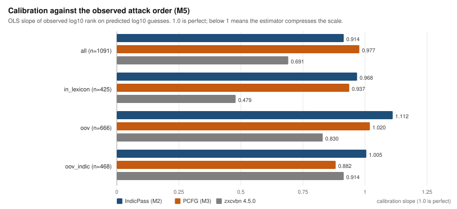
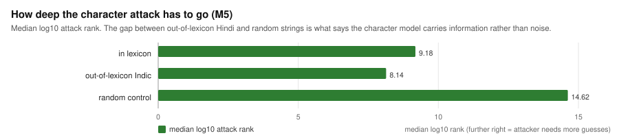
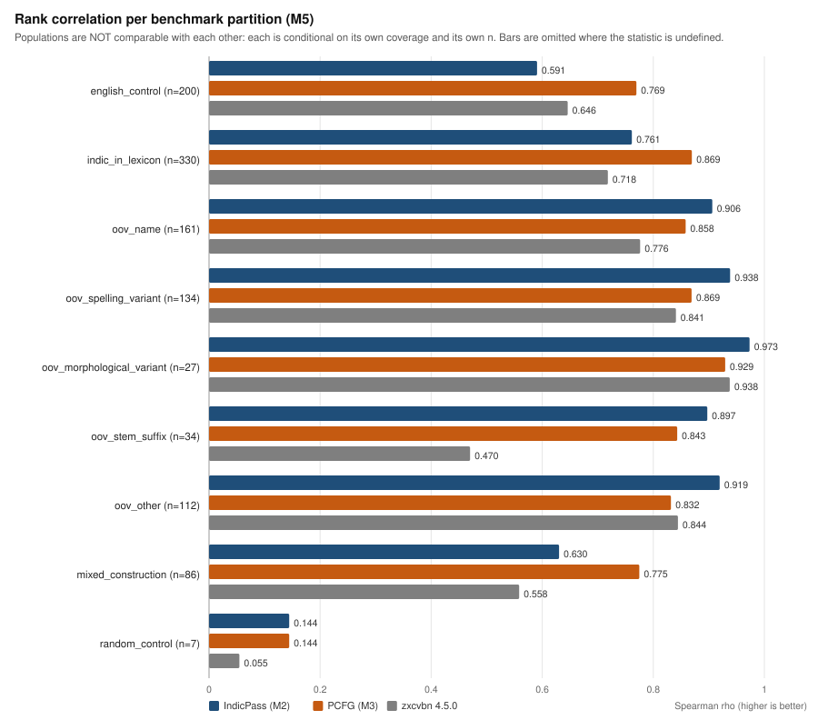

# IndicPass: a Romanized-Indic password-strength estimator, and what two independent attackers say about it

Final research report. Generated 2026-09-08T04:56:07+00:00 from IndicPass v0.1.0 at `8a09173ef351`.

Every number below is read from a committed milestone report and is not recomputed here. Section 24 lists the commands that regenerate all of them, and the JSON beside this file carries each figure with the report and key it came from.

## 1. Abstract

Password-strength meters are built on English wordlists. India's 297,747-word Romanized-Hindi vocabulary is absent from them, so a password like `namaste@123` is scored as though it were random text. IndicPass builds a Romanized-Indic dictionary from a trained transliteration model and prices passwords against it (**M2**), adds a probabilistic grammar with a character model so that a Hindi spelling the dictionary never saw is still recognisably Hindi (**M3**), and then -- because comparing two estimators with each other cannot say which is right -- validates both against two **independent, bounded reference attackers** whose ranks are observed rather than estimated (**M4**, **M5**).

The measured result is a split, and it is stable. On the 468 out-of-lexicon Indic targets M2 orders passwords better (Spearman 0.919 against M3's 0.858) while M3 gets the magnitude closer (MAE 1.037 against M2's 1.128). Both differences hold in every attacker arm, including the one that shares no training evidence with either estimator. Both estimators beat zxcvbn on every metric by a wide margin. The character model's out-of-lexicon *mechanism* is confirmed -- an unseen Hindi spelling is reached 6.49 orders of magnitude earlier than a random string of similar shape -- but that mechanism does not make M3 the better ranker.

**Milestone 3's central out-of-lexicon claim is therefore partially supported**: supported for calibration, unsupported for ordering. The shipped 0-4 score continues to come from M2.

## 2. Problem statement

A strength meter estimates how many guesses an attacker needs. Every widely deployed one -- zxcvbn among them -- does this by matching the password against wordlists, and those wordlists are English. Hundreds of millions of people choose passwords from a Romanized Indic vocabulary that appears in none of them, so the meter finds no structure, falls back on a brute-force estimate, and reports a weak password as strong. That is the dangerous direction of error: it tells someone a crackable password is fine.

The engineering problem is that no Romanized-Indic password wordlist exists, and no leaked Indian password corpus can be used to build one in an academic project. The scientific problem is harder: even with such a lexicon, showing that an estimate *improved* requires a ground truth that is not itself an estimate.

## 3. Research gap

| gap | how this project addresses it |
| --- | --- |
| No Romanized-Indic password lexicon | Build one from a trained transliteration model over Aksharantar, joined to an external frequency table (M1) |
| Romanized Hindi has no standard orthography, so any fixed lexicon misses real spellings | A character model over the lexicon's spellings, so unseen ones are still priced as Hindi (M3) |
| Estimator comparisons are estimator-versus-estimator | Two independent bounded attackers whose ranks are observed, not modelled (M4, M5) |
| A wordlist attacker structurally cannot reach the out-of-lexicon population | A second attacker whose candidates come from a character model (M5) |
| Point estimates on sub-populations of a few hundred | Paired bootstrap intervals on every headline metric and on the differences (M5) |

## 4. Threat / attacker model

Both attackers are **bounded reference models**. They are specified completely, they are reproducible from a seed and a config, and their ranks are exact. They are **not** claims about the space of real attackers: neither has a leaked password corpus, leet substitution, keyboard walks, or targeted personal data, and no leaked corpus is used anywhere in this project.

| | M4 -- reference attack | M5 -- character attack |
| --- | --- | --- |
| candidate source | IndicDict spellings, ordered | any lower-case letter string, generated |
| structure | `case(word) + suffix`, plus `word+word` | `case(stem) + suffix` |
| ordering | rule block, then wordlist position | quantised cost level, then shape, then stem |
| budget | 10^16 candidates | 10^16 candidates (inherited, so the two are comparable) |
| universe | 10^15.85 | 10^15.79 (levels 0-70) |
| reaches out-of-lexicon spellings | **no, structurally** | **yes** |
| enumeration | counted, never materialised | counted, never materialised |

Neither attack builds a wordlist at any point. Both invert their ordering arithmetically, so a rank is recovered without listing anything that precedes it, and **no cracking wordlist exists anywhere in this pipeline**.

## 5. IndicDict construction

297,747 Romanized-Hindi entries, built offline by `scripts/build_indicdict.py` from the trained transliterator and committed as a build artefact. Scoring is a dictionary lookup; the neural model never runs at scoring time.

| provenance tier | entries |
| --- | ---: |
| `human_romanized` | 30,400 |
| `curated_entities` | 25,005 |
| `curated_other` | 122,342 |
| `mined` | 120,000 |
| **total** | **297,747** |

Tiers order entries by *how the pair was produced* -- human romanizations first, model-mined last -- and are the fallback pricing policy. An entry whose native form was found in the external frequency table is priced by its measured rank instead; only the remainder fall back to a tier.

Measured against a curated probe set of everyday Romanized Hindi, coverage is **38.0%** overall. That number is a finding, not a failure to fix: words are never added to the dictionary to make it look better, and the gap is precisely what M3's character model exists for.

## 6. M2 -- the lexical estimator

M2 prices a password as the cheapest explanation an attacker has: segment it, match segments against IndicDict, charge each match its position in a frequency-ordered wordlist, charge digits/years/symbols/case their own costs, and take the minimum over segmentations. The output is `log10_guesses`, and the 0-4 score is a threshold on it.

Against zxcvbn on the generated benchmark, by category:

| category | n | M2 mean log10 | zxcvbn mean log10 | difference | M2 match rate |
| --- | ---: | ---: | ---: | ---: | ---: |
| english | 200 | 7.08 | 3.88 | +3.19 | 60.5% |
| indic_word | 200 | 4.35 | 4.24 | +0.11 | 43.5% |
| indic_numeric | 200 | 7.87 | 7.09 | +0.78 | 45.5% |
| indic_year | 200 | 6.85 | 6.52 | +0.33 | 47.5% |
| indic_symbol | 200 | 6.98 | 6.98 | -0.00 | 45.5% |
| mixed | 200 | 11.92 | 10.14 | +1.78 | 77.5% |
| random | 200 | 11.01 | 10.97 | +0.05 | 1.0% |

A *lower* estimate is not automatically a better one: that judgement needs a reference attack, which is what M4 and M5 supply. Read this table as "the two estimators disagree, and here is where".

## 7. M3 -- the PCFG and the character model

M3 is a probability model over passwords -- structure prior, word distribution, digit/year/symbol distributions, and an order-4 character n-gram with Witten-Bell smoothing over the dictionary's spellings -- from which a guess number is derived by *counting* a sampled guess curve rather than by a formula.

The character model exists for one reason, and it works. Cost per character, `-log10 P`, lower means the model finds the text likelier:

| population | words | log10 cost per character |
| --- | ---: | ---: |
| indic_bank_in_dictionary | 62 | 0.9350 |
| indic_bank_absent_from_dictionary | 101 | 0.9364 |
| english_control | 76 | 1.0474 |
| random_lowercase | 500 | 2.2042 |
| *(brute-force floor)* | -- | 1.0000 |

**This is the generalisation test, and it passes.** Hindi words the dictionary contains cost 0.9350 per character; Hindi words it does **not** contain cost 0.9364 -- a difference of 0.0014. The model learned the shape of the language, not its vocabulary. Random lower-case text costs 2.2042, well above the brute-force floor, so the grammar cannot make a random string look cheap.

## 8. M4 -- the independent reference attack

A wordlist run through an ordered rule programme, which is what hashcat and John the Ripper do and what every published cracking study assumes. The lexicon is IndicDict's spellings in a documented order; the rules are bounded products of the lexicon with suffix families. A target's rank is the first position the enumeration emits it at, recovered by inverting the rule.

Universe 10^15.85 candidates. **Independence is mechanical**: the module imports nothing but the standard library, and the tests assert that by parsing its import set, by denylisting the estimator modules, and by ranking a corpus with all three estimators replaced by objects that raise on contact.

## 9. M5 -- the out-of-lexicon attack

M4 has one structural limitation and it is the one that matters: its universe is a wordlist, so a password built from a spelling the wordlist lacks is not in it at all. M5 replaces the wordlist with a character model, so the candidate is `case(stem) + suffix` where **stem is any string over the 26 lower-case letters** within a length band. An out-of-lexicon spelling becomes reachable on the same terms as one the dictionary holds.

Candidates are ordered by an integer quantised cost level; the number at each level is a dynamic programme over `(remaining length, context, remaining level)`, so a universe of 10^22 stems is **counted without being built** and a rank is recovered by inversion. The character model is independently implemented with different order and different smoothing from M3's, and the module again imports nothing but the standard library.

The budget is inherited from M4 -- the same 10^16 candidates -- so the difference in their coverage is a statement about the candidate model rather than about how long each attacker was allowed to run.

## 10. Experimental methodology

1. Generate the benchmark from a committed word bank and a seed.
2. Score every password with all three estimators **once, before any attack object exists**. The pipeline is written so this cannot be reordered, and a test parses `main()` to assert it.
3. Build each attacker and rank every target. Reuse the scores unchanged across every attacker arm.
4. Partition the targets by dictionary membership and by an out-of-lexicon taxonomy, mechanically, before any metric is computed.
5. Compute metrics per population on **reachable targets only**, and report coverage beside every one of them.
6. Bootstrap the primary metrics and the paired differences.
7. Re-run the whole experiment in a second process and compare byte for byte.

Ablation arms change exactly one thing each, so a conclusion that depends on an assumption shows up as an arm that disagrees.

## 11. Benchmark composition

1,400 generated samples, generator version 1.0, seed 42. The corpus is **generated, not collected**: no real password appears anywhere, and no password reaches disk in any report.

| category | samples | role |
| --- | ---: | --- |
| `english` | 200 | generic control -- a non-Indic estimator should already handle these |
| `indic_word` | 200 | single Romanized Hindi word |
| `indic_numeric` | 200 | word + digit run |
| `indic_year` | 200 | word + year |
| `indic_symbol` | 200 | word + symbol (+ digits) |
| `mixed` | 200 | two lexical pieces concatenated |
| `random` | 200 | upper control -- no lexical structure to find |

The Indic word bank was written from everyday usage and deliberately **not** sampled from IndicDict: sampling the dictionary would guarantee coverage and measure nothing. The consequence is that many bank words are missing from the dictionary, and that population is the subject of section 16.

M5 partitions the same 1,400 targets mechanically:

| partition | targets | in IndicDict | reachable | coverage |
| --- | ---: | ---: | ---: | ---: |
| `random_control` | 200 | 5 | 7 | 3.5% |
| `english_control` | 200 | 95 | 200 | 100.0% |
| `mixed_construction` | 200 | 0 | 86 | 43.0% |
| `indic_in_lexicon` | 332 | 332 | 330 | 99.4% |
| `oov_name` | 161 | 0 | 161 | 100.0% |
| `oov_spelling_variant` | 134 | 0 | 134 | 100.0% |
| `oov_morphological_variant` | 27 | 0 | 27 | 100.0% |
| `oov_stem_suffix` | 34 | 0 | 34 | 100.0% |
| `oov_other` | 112 | 0 | 112 | 100.0% |

## 12. M4 results

Coverage **528/1400 (37.7%)**. Of the 872 targets whose stem is absent from the lexicon, **0 are reachable** -- the structural limitation that motivated M5.

| estimator | n | Spearman | Pearson | mean err | MAE | RMSE | +-1.0 |
| --- | ---: | ---: | ---: | ---: | ---: | ---: | ---: |
| IndicPass (M2) | 528 | 0.900 | 0.889 | -1.951 | 1.955 | 2.440 | 26.3% |
| PCFG (M3) | 528 | 0.806 | 0.788 | -0.377 | 1.370 | 1.934 | 50.2% |
| zxcvbn 4.5.0 | 528 | 0.592 | 0.584 | -2.417 | 2.828 | 3.558 | 14.0% |

**Control.** The attack reaches 1 of 200 random strings (0.5%). It must not reach them: its rules are a wordlist crossed with short suffixes, and a high number here would mean the lexicon was matching noise.

## 13. M5 results



| population | targets | reachable | coverage | median log10 rank |
| --- | ---: | ---: | ---: | ---: |
| `all` | 1400 | 1091 | 77.9% | 9.02 |
| `in_lexicon` | 432 | 425 | 98.4% | 9.18 |
| `oov` | 968 | 666 | 68.8% | 8.78 |
| `oov_indic` | 468 | 468 | 100.0% | 8.14 |

Coverage rises from 37.7% to 77.9% overall, and from **0 of 872** to **468 of 468** on out-of-lexicon Indic targets.

The targets M5 still cannot reach are excluded for named reasons, and each is given **no rank at all**:

| reason | targets |
| --- | ---: |
| `no_shape` | 157 |
| `level_above_budget` | 147 |
| `stem_too_long` | 5 |

## 14. M2 against M3 -- ordering





| population | n | rho M2 | rho M3 | rho zxcvbn | M3 - M2 [95% CI] |
| --- | ---: | ---: | ---: | ---: | --- |
| `all` | 1091 | 0.764 | 0.851 | 0.591 | 0.087 [0.072, 0.103] |
| `in_lexicon` | 425 | 0.721 | 0.818 | 0.474 | 0.098 [0.076, 0.122] |
| `oov` | 666 | 0.910 | 0.887 | 0.665 | -0.023 [-0.039, -0.008] |
| `oov_indic` | 468 | 0.919 | 0.858 | 0.772 | -0.060 [-0.078, -0.044] |
| `random_control` | 7 | 0.144 | 0.144 | 0.055 | 0.000 |
| `english_control` | 200 | 0.591 | 0.769 | 0.646 | 0.179 [0.122, 0.239] |
| `mixed_construction` | 86 | 0.630 | 0.775 | 0.558 | 0.145 [0.056, 0.243] |
| `indic_in_lexicon` | 330 | 0.761 | 0.869 | 0.718 | 0.108 [0.083, 0.137] |
| `oov_name` | 161 | 0.906 | 0.858 | 0.776 | -0.048 [-0.078, -0.025] |
| `oov_spelling_variant` | 134 | 0.938 | 0.869 | 0.841 | -0.069 [-0.111, -0.038] |
| `oov_morphological_variant` | 27 | 0.973 | 0.929 | 0.938 | -0.044 [-0.150, 0.005] |
| `oov_stem_suffix` | 34 | 0.897 | 0.843 | 0.470 | -0.054 [-0.154, 0.017] |
| `oov_other` | 112 | 0.919 | 0.832 | 0.844 | -0.088 [-0.148, -0.043] |

**M2 orders better wherever the population is out of lexicon; M3 orders better wherever it is in lexicon.** Both directions have intervals that exclude zero. This is not a contradiction: M3's advantage comes from its word distribution, which needs the word to be in the dictionary, and out of lexicon both estimators fall back on something strongly length-driven that M2 happens to track slightly better.

## 15. M2 against M3 -- calibration







| population | n | MAE M2 | MAE M3 | MAE zxcvbn | M3 - M2 [95% CI] |
| --- | ---: | ---: | ---: | ---: | --- |
| `all` | 1091 | 2.214 | 1.471 | 3.138 | -0.743 [-0.800, -0.687] |
| `in_lexicon` | 425 | 3.310 | 1.763 | 3.459 | -1.546 [-1.631, -1.461] |
| `oov` | 666 | 1.515 | 1.285 | 2.933 | -0.230 [-0.282, -0.180] |
| `oov_indic` | 468 | 1.128 | 1.037 | 2.003 | -0.091 [-0.141, -0.042] |
| `random_control` | 7 | 5.927 | 5.927 | 6.187 | 0.000 |
| `english_control` | 200 | 2.930 | 2.064 | 6.122 | -0.866 [-0.991, -0.736] |
| `mixed_construction` | 86 | 2.919 | 1.857 | 4.399 | -1.062 [-1.283, -0.839] |
| `indic_in_lexicon` | 330 | 3.058 | 1.532 | 2.545 | -1.525 [-1.620, -1.431] |
| `oov_name` | 161 | 1.332 | 1.164 | 2.720 | -0.168 [-0.256, -0.083] |
| `oov_spelling_variant` | 134 | 0.871 | 0.827 | 1.401 | -0.043 [-0.129, 0.038] |
| `oov_morphological_variant` | 27 | 0.962 | 0.836 | 1.412 | -0.126 [-0.285, -0.005] |
| `oov_stem_suffix` | 34 | 0.879 | 0.869 | 2.385 | -0.010 [-0.226, 0.220] |
| `oov_other` | 112 | 1.260 | 1.205 | 1.718 | -0.055 [-0.136, 0.019] |

**M3 has the lower absolute error in every population**, and the interval excludes zero in most of them. Its mean *signed* error is also closer to zero, meaning it is less systematically pessimistic. Both estimators under-estimate the attack throughout -- the safe direction for a meter, and still an error.

## 16. Out-of-lexicon findings



| population | median log10 attack rank |
| --- | ---: |
| in lexicon | 9.18 |
| out-of-lexicon Indic | 8.14 |
| random control | 14.62 |

**6.49 orders of magnitude** separate an out-of-lexicon Hindi spelling from a random string. This is the milestone's strongest positive result and it confirms M3's proposed mechanism independently of M3: a character model trained only on a transliteration dictionary really does place Hindi-shaped spellings it has never seen far earlier in an attack than noise. Section 7's generalisation test says the same thing from inside M3.

What it does **not** show is that M3's estimator exploits that mechanism better than M2 does. The verdict, decided by a rule fixed before the numbers were seen:

| sub-claim | statistic | M2 | M3 | M3 - M2 [95% CI] | holds without shared evidence | status |
| --- | --- | ---: | ---: | --- | --- | --- |
| ordering | `spearman` | 0.919 | 0.858 | -0.060 [-0.078, -0.044] | False | **unsupported** |
| calibration | `mean_absolute_error` | 1.128 | 1.037 | -0.091 [-0.141, -0.042] | True | **supported** |

Overall: **partially supported**.



## 17. Comparison with zxcvbn

zxcvbn is the deployed generic estimator and the reason a comparative claim is possible at all. It is **not an Indic-specific attacker** and is not being criticised for failing at something it was not built for; it is the measurement of what a generic meter does with this population.

| population | n | rho | MAE | RMSE | +-1.0 |
| --- | ---: | ---: | ---: | ---: | ---: |
| `all` | 1091 | 0.591 | 3.138 | 3.835 | 15.2% |
| `in_lexicon` | 425 | 0.474 | 3.459 | 4.159 | 11.8% |
| `oov` | 666 | 0.665 | 2.933 | 3.614 | 17.4% |
| `oov_indic` | 468 | 0.772 | 2.003 | 2.463 | 24.4% |

On out-of-lexicon Indic targets zxcvbn's absolute error is 2.00 orders of magnitude against M2's 1.13 and M3's 1.04 -- roughly **twice** either Indic estimator's. Its rank correlation is lower than both in every population. This is the one comparison in the report that is not close, and it is the project's practical justification.

## 18. Robustness and control experiments

**Random controls.** M4 reaches 0.5% of random strings; M5 reaches 3.5% of them and only at a median rank of 14.62. Neither attack finds structure that is not there.

**Attacker arms.** Each arm changes exactly one thing. The M5 direction on out-of-lexicon targets is identical in all of them:

| arm | shares evidence with an estimator | n | rho M2 | rho M3 | M3 wins rho | M3 wins MAE |
| --- | --- | ---: | ---: | ---: | --- | --- |
| `indicdict` | yes | 468 | 0.919 | 0.858 | False | True |
| `uniform` | no | 453 | 0.952 | 0.902 | False | True |
| `holdout_half` | yes | 468 | 0.922 | 0.862 | False | True |
| `order_2` | yes | 465 | 0.923 | 0.862 | False | True |
| `smoothing_0.1` | yes | 468 | 0.918 | 0.858 | False | True |
| `precision_0.5` | yes | 468 | 0.929 | 0.874 | False | True |
| `budget_1e12` | yes | 449 | 0.908 | 0.840 | False | True |

**The strongest robustness result is the `uniform` row.** That arm has no character statistics at all -- every symbol costs the same, so the ordering is length then spelling -- which means no estimator has any informational advantage in it. The M2-orders-better / M3-calibrates-better split survives there unchanged, so it is a statement about the estimators rather than about shared training data.

**M4's arms** agree in the same way: the ordering result holds under `shuffled` and `length`, the two arms whose wordlist order no estimator has access to.

| arm | independent | coverage | rho M2 | rho M3 | rho zxcvbn |
| --- | --- | ---: | ---: | ---: | ---: |
| `frequency` | NO | 37.7% | 0.900 | 0.806 | 0.592 |
| `shuffled` | yes | 37.7% | 0.885 | 0.793 | 0.590 |
| `length` | yes | 37.7% | 0.890 | 0.809 | 0.605 |
| `family_rules` | NO | 37.7% | 0.812 | 0.716 | 0.559 |
| `budget_1e12` | NO | 32.9% | 0.866 | 0.783 | 0.558 |
| `no_combinator` | NO | 30.5% | 0.918 | 0.875 | 0.714 |

## 19. Uncertainty and bootstrap methodology

Percentile bootstrap, 2,000 resamples, fixed seed, 95.0% intervals. Resample indices are drawn **once per population and shared by every estimator**, which is what makes the reported differences paired: both estimators see the same targets in the same resample, so the interval is on their difference rather than on two independent quantities. Populations below 20 targets get point estimates and explicitly no interval.

Intervals on the out-of-lexicon Indic population (n = 468):

| estimator | Spearman | MAE | RMSE | +-1.0 | calibration slope | r^2 |
| --- | --- | --- | --- | --- | --- | --- |
| IndicPass (M2) | 0.919 [0.900, 0.934] | 1.13 [1.05, 1.20] | 1.40 [1.30, 1.48] | 0.498 [0.451, 0.541] | 1.005 [0.961, 1.050] | 0.841 [0.815, 0.866] |
| PCFG (M3) | 0.858 [0.827, 0.885] | 1.04 [0.97, 1.10] | 1.27 [1.19, 1.36] | 0.528 [0.483, 0.575] | 0.882 [0.840, 0.923] | 0.770 [0.734, 0.806] |
| zxcvbn 4.5.0 | 0.772 [0.725, 0.816] | 2.00 [1.87, 2.14] | 2.46 [2.29, 2.63] | 0.244 [0.205, 0.282] | 0.914 [0.840, 0.991] | 0.554 [0.489, 0.622] |

An interval that excludes zero is reported as excluding zero. It is **not** called significant, and overlapping intervals are not treated as evidence of no difference -- which is precisely why the paired difference is reported separately from the two estimators' own intervals.

## 20. Limitations

1. **The attacks are bounded reference models, not the space of real attackers.** No leaked-password list, no Markov or PCFG guess generator, no leet substitution, no keyboard walks, no targeted personal data. An estimator that predicts these attacks well may predict another badly.
2. **Metrics are conditional on reachability.** M4 scores on 37.7% of the benchmark and M5 on 77.9%; an unreachable target is given no rank and contributes to coverage and to nothing else. Coverage is reported beside every metric.
3. **The benchmark is synthetic.** Generated from a hand-written Romanized Hindi word bank, not observed passwords. It supports claims about estimator ordering, not about the distribution of real Indian passwords.
4. **One language, one dictionary source.** Hindi, from Aksharantar, via one trained transliteration model at test CER 0.108.
5. **Structure priors are assumptions, not measurements.** M3's segment and category priors, and both attacks' rule orderings, are maximum-entropy choices standing in for distributions that need a password corpus to learn. Each is reported with a sensitivity arm.
6. **Evidential independence is partial in one arm each.** M4's `frequency` arm and M5's `indicdict` arm share training evidence with the estimators they score; the `shuffled`, `length` and `uniform` arms remove it.
7. **Quantised levels are not probabilities.** M5's cost levels define its enumeration order and are not claimed to be a probability model.
8. **The out-of-lexicon taxonomy is a heuristic.** The in-lexicon / out-of-lexicon split is exact dictionary membership; the finer families will mislabel some targets.
9. **No human-subject evaluation.** Whether the 0-4 bands change anyone's password choice is untested.

## 21. Threats to validity

**Construct validity.** "Attack rank" is the position one specified attacker emits a password at. It is exact, and it is not the number of guesses a real attacker needs. Every claim in this report is about agreement with a reference attacker, never about real-world cracking.

**Internal validity.** The estimators are scored on targets the attack reaches, which is a selected population. Coverage is printed beside every metric so the selection is visible, and M5 exists because M4's selection excluded the population the central question is about. The residual risk is that M5's own 22.1% of unreachable targets are not missing at random -- they are concentrated in mixed constructions and random controls, which is stated rather than corrected for.

**External validity.** The benchmark is generated from a hand-written word bank. It is plausible Romanized Hindi, not observed passwords, and no claim about the distribution of real Indian passwords is supported by it. The dictionary comes from one transliteration corpus for one language.

**Circularity.** M4's `frequency` arm and M5's `indicdict` arm share evidence with the estimators they score. This is stated in both reports, and both carry arms that remove the shared evidence entirely. Every conclusion in this report is one that holds in those arms too.

**Researcher degrees of freedom.** The M5 verdict rule was written before the numbers were computed and is reproduced verbatim in the report. M2 and M3 were not modified in response to any result.

## 22. Conclusions

1. **A Romanized-Indic lexicon can be built without a leaked corpus.** 297,747 entries, derived from a trained transliteration model, priced by an external frequency table, reproducible from committed source.
2. **Both Indic estimators substantially beat a generic one on this population.** zxcvbn's absolute error against the observed attack order is roughly twice either's, on every population measured.
3. **M2 is the better ranker; M3 is the better calibrator.** The split is stable across two independent attackers, seven M5 arms and six M4 arms, including every arm that shares no evidence with either estimator.
4. **M3's out-of-lexicon mechanism is real.** An unseen Hindi spelling is reached 6.49 orders of magnitude earlier than noise, and M3's own character model prices dictionary-absent Hindi words the same as dictionary-present ones.
5. **The mechanism does not make M3 the better estimator overall.** On the out-of-lexicon population it wins calibration and loses ordering, and the difference is small in both directions.
6. **The shipped 0-4 score therefore stays on M2**, with M3 and zxcvbn reported alongside. A 0-4 band is an ordering device, and M2 orders best.

The negative result is kept deliberately. M3 was built to improve out-of-lexicon estimation, and on the metric a strength meter actually needs, it did not.

## 23. Future work

* **A real password corpus.** Every structure prior in M3 and every rule ordering in M4/M5 is a maximum-entropy assumption standing in for a distribution nobody here can measure. This is the single largest source of error.
* **More languages.** The pipeline is language-parameterised; only Hindi is built.
* **A hybrid estimator**, if and only if it is fitted on data disjoint from the evaluation benchmark. Fitting one on these 1,400 samples would measure the generator, which is why this project does not ship one.
* **Attackers with leaked-corpus wordlists**, to test whether the ordering result survives an attacker whose candidate order is learned rather than assumed.
* **Human-subject validation** of whether the 0-4 bands change behaviour.

## 24. Reproduction

Full environment, hashes and expected outputs are in `docs/REPRODUCING.md`. In short:

```bash
python -m pip install -r requirements/dev.txt

# The dictionary is a build artefact (~35 min on CPU, needs torch).
# Skip if data/dictionaries/indicdict_hin.jsonl is already present.
python scripts/build_indicdict.py --languages hin

# M1/M2: coverage, benchmark, ablations, sensitivity
python scripts/indicdict_coverage.py --languages hin
python scripts/password_benchmark.py --languages hin

# M3: fit the grammar, then evaluate it
python scripts/train_pcfg.py --languages hin
python scripts/pcfg_benchmark.py --languages hin

# M4 and M5: the two reference attacks
python scripts/reference_attack.py --languages hin
python scripts/milestone5_oov_attack.py --languages hin

# Determinism: every pipeline twice, in separate processes, compared byte for byte
python scripts/verify_reproducibility.py --languages hin

# This report
python scripts/final_report.py

python -m pytest
python -m ruff check .
```

| artefact | SHA-256 |
| --- | --- |
| dictionary_file | `sha256:2a91a9f3c8fb699277fab68905bb94476d410c765fae15461e4d38f655aa6642` |
| pcfg_artefact | `sha256:189b32a765f313f230da5e73cba47135974420985157155951f40fa858dc0827` |
| attack_fingerprint | `sha256:0166a4f715559362431d01a4088df7e42ba83147f181dcb7ab0db84789c8a435` |
| character_model_fingerprint | `sha256:ab07531bd53c40870fbdea88e737fd63d9bf19b9468344cb433c827e7343224f` |
| corpus_digest | `sha256:2356a7d602926706fc7ed0d67884d7c1c9f8e4e57b456d00dc3bdbcb1a8edd6a` |
| m5_canonical | `sha256:d1e94bfefe9449390eeb7f062bae6f976a7c86b5890730f3d1b83b41bfd7b2b7` |
| m5_byte_identical | `True` |

| source report | milestone | SHA-256 |
| --- | --- | --- |
| `results/reports/indicdict_coverage_hin.json` | M1/M2 | `fecc9498cc37dbf6...` |
| `results/reports/password_benchmark_hin.json` | M2 | `a5f376d007538f26...` |
| `results/reports/mined_tier_ablation.json` | M2 | `796f03b220182828...` |
| `results/reports/guess_model_sensitivity.json` | M2 | `db34c740913ed7a9...` |
| `results/reports/pcfg_benchmark_hin.json` | M3 | `b2ef96099928c63a...` |
| `results/reports/pcfg_targeted_hin.json` | M3 | `9428502116bd526b...` |
| `results/reports/reference_attack_hin.json` | M4 | `6009e0e5357fac16...` |
| `results/reports/milestone5_oov_attack.json` | M5 | `ae61b08795fb6cf7...` |
| `results/reports/reproducibility.json` | verify | `949ea95e0d2bb125...` |

**Cross-report consistency: all checks pass.** Every experiment quoted above was run against the same corpus, the same dictionary build, the same trained grammar and the same baseline:

| check | consistent |
| --- | --- |
| corpus_size | True |
| generator_version | True |
| dictionary_entries | True |
| pcfg_fingerprint | True |
| baseline | True |

---

*No password appears in this report or in any report it draws from. The benchmark regenerates from committed source and a seed; rows are keyed on `sample_id`.*

